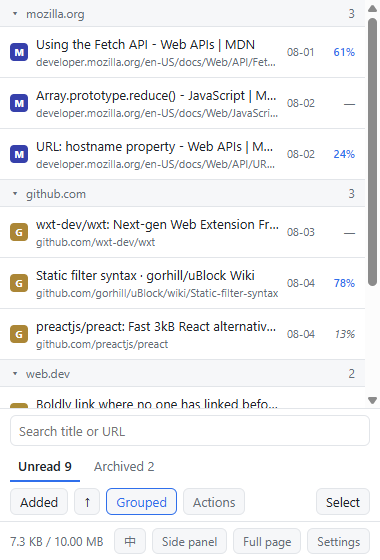
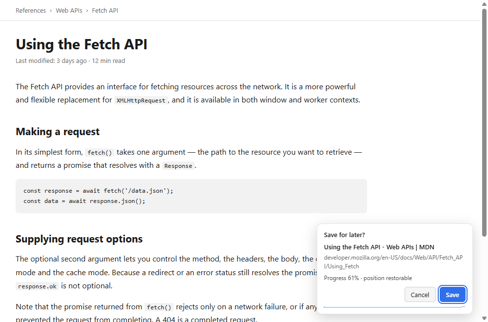
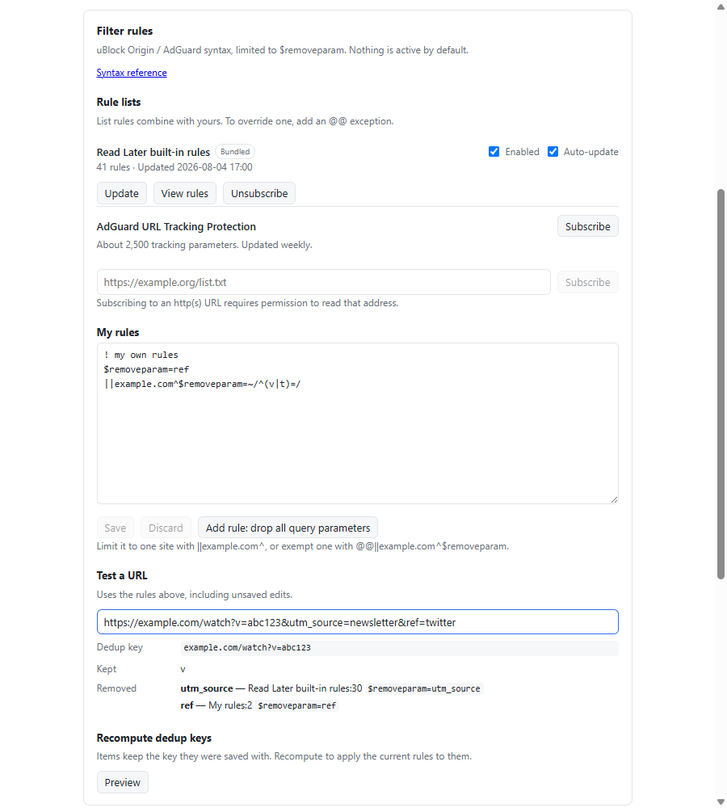

# Read Later

_[中文文档](./README.zh-CN.md)_

A temporary bookmark for reading later.



Right-click a page or a link, choose "Read Later", and it is saved with a best-effort reading
position. Click the item later and it will try to return to where you stopped.

## Install

```bash
pnpm install && pnpm build
```

Then `chrome://extensions` → **Developer mode** → **Load unpacked** → pick `.output/chrome-mv3/`.

## Reading positions



If the page can save reading positions, Read Later will try to get the current position when
saving, and restore it the next time you open it.

## Handling duplicates

Two links to the same article often differ only by a `?utm_source=` or `?fbclid=` parameter.
Read Later uses **uBlock Origin / AdGuard filter rules** to decide whether they are one page.

**Nothing is on by default** — `?v=` and `?id=` are the real content on plenty of sites, and
merging two different articles loses one of them. Subscribe to a rule list, or write your own:

```
$removeparam=fbclid                      drop fbclid everywhere
||example.com^$removeparam=/^utm_/       drop matching parameters on one site
||example.com^$removeparam=~/^(v|t)=/    keep ONLY v and t there
@@||example.com^$removeparam             never touch that site
```



The settings page can test your rules against a URL.

## Storage

Kept in the browser's own extension storage, capped at 10 MB. JSON backup and import cover the
unread list only.

## Permissions

Permission to read a website is only requested when you subscribe to a rule list.

## Planned

- [ ] GitHub Actions build and release
- [ ] Chrome Web Store listing

## Development

```bash
pnpm install
pnpm dev        # a Chrome with the extension loaded, hot-reloading
pnpm build      # → .output/chrome-mv3/
pnpm test
```

WXT + Preact + TypeScript.

## License

[MIT](./LICENSE)
