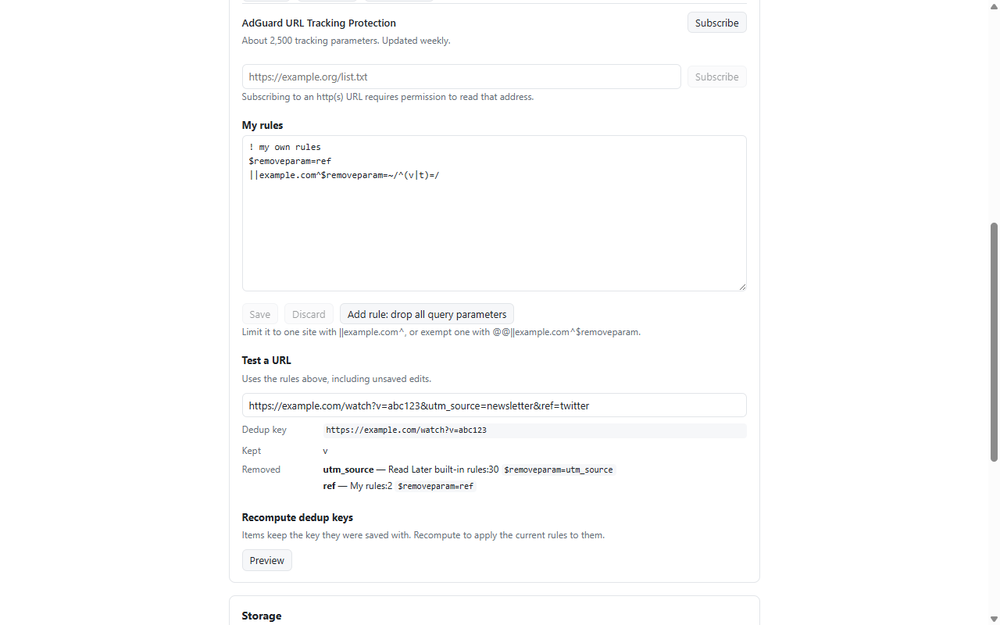

# Read Later

_[English](./README.md)_

一个用于稍后阅读的临时书签。

点击下方图片，从 Chrome 应用商店安装 Read Later。

[](https://chromewebstore.google.com/detail/read-later/gfmiooeigdpplnkpgklflkfneaglfbch)


右键页面或链接打开右键菜单后，选择「Read Later」即可保存页面和尽力恢复的阅读位置。再次点击条目时，会尝试返回你上次阅读的位置。

## 阅读位置


如果页面能够保存阅读位置，Read Later 会在保存时尝试获取当前位置，并在下次打开时恢复。

## 重复条目处理

指向同一篇文章的两个链接，常常只是 `?utm_source=` 或 `?fbclid=` 的参数区别。
Read Later 用 **uBlock Origin / AdGuard 的过滤规则**判断「这是不是同一个页面」，

**默认什么都不生效** —— `?v=` 和 `?id=` 在很多站点上就是内容本身，把两篇不同的文章合并掉会丢掉一篇。
可通过订阅规则列表，或者自己写订阅实现处理：

```
$removeparam=fbclid                      全站剥掉 fbclid
||example.com^$removeparam=/^utm_/       只在这个站剥掉匹配的参数
||example.com^$removeparam=~/^(v|t)=/    在这个站只保留 v 和 t
@@||example.com^$removeparam             永远不碰这个站
```



设置页可以使用 URL 测试规则。

## 存储

存在浏览器自己的扩展存储里，上限 10 MB。JSON 备份和导入仅包含未读列表。

## 权限

仅在订阅网络规则列表时请求对应网站权限。

## 隐私

待读列表和阅读位置只保存在浏览器本地的扩展存储中。完整的数据处理说明见
[隐私政策](./docs/PRIVACY.md)。

## 开发

```bash
pnpm install
pnpm dev        # 开一个带扩展的 Chrome，改代码自动重载
pnpm build      # → .output/chrome-mv3/
pnpm test
```

若要手动加载构建产物，先运行 `pnpm build`，再打开 `chrome://extensions`，启用**开发者模式**，
选择**加载已解压的扩展程序**，然后选择 `.output/chrome-mv3/`。

WXT + Preact + TypeScript。

## License

[MIT](./LICENSE)
